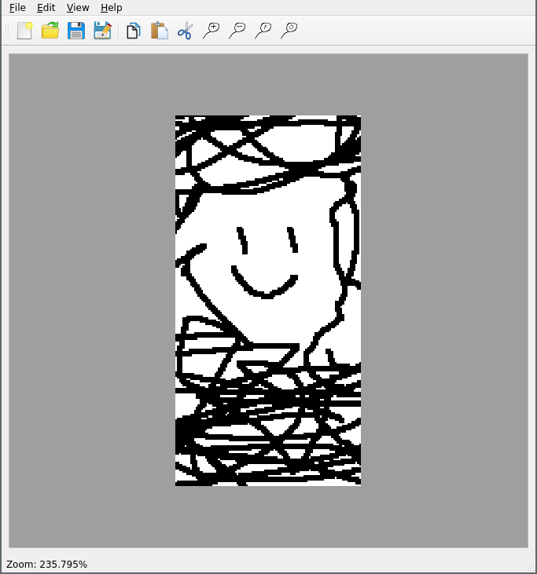

# M3ImageManipulator

## Requirements

### Phase 1

#### TODO

* The GUI language is English, the source code has to be prepared for later translation
* A picture - at least BMP, JPEG, & PNG - can be loaded from file and will be displayed
* If present, Qt standard dialogues are used for opening, saving, ...
* The application determines what image formats are available on the current system under QT and offers them in the file dialogues
* The "View" - menu comprises at least Zoom In (Ctrl++), Zoom out (Ctrl+-), Zoom 100% (Ctrl+0), Fit to Window (Ctrl+F), and Show Dialog
* Not available functions are disabled
* The application has an icon if supported by the OS
* The image can be shown in selectable zoom modes between 25% and 400%
* The current zoom is shown in the status bar
* The visible part of the image can be moved by dragging with the mouse
* The mouse pointer turns into a grabbing hand when dragging
* An image file can be dragged and dropped into the application from the file explorer or alike
* The shown picture can be printed, where the printer can be selected from a standard dialogue
* The application saves window size, position, and other important settings and restores them upon start
* The name of the shown image file is shown in the window title without path prefix
* If loading or saving an image fails, a useful error message is displayed
* Joker: A requirement of my choice

#### DONE

* The most important menu items have keyboard shortcuts
* The main window can be resized and implements standard behavior, such as minimum and maximum size
* The "File" - menu comprises at least the items Open, Save, Save As, Print, & Exit
* The "Edit" - menu comprises at least the items Copy & Paste
* The app is a Qt 5.9 widget application using a single document interface
* The application has a menu comprising "File", "View", & "Help"
* The Help menu comprises at least an about item for this application and one for Qt
* The visible part of the image can be moved using scroll bars
* Image files can be pasted from the clipboard
* Image files can be copied to the clipboard
* The status bar shows important information - status tips

### Phase 2

#### TODO

* Color correction can be done in RBG or YUV color space, which is a setting in the dialogue
* The strength of color correction can be set using a slider for every channel of the color space
* Therefore, there are 6 sliders in 2 groups - RGB & YUV
* Only one of the 2 groups of sliders is enabled
* Which group of sliders is enabled is determined by 2 radio buttons choosing between RGB and YUV
* Values for R, G, B, & Y are from 0 to 100% and for U & V from -100% to 100%
* The dialog has a preview button which shows the result while pressed
* The dialog has an OK button applying the changes
* The dialog has a Cancel button dismissing the changes
* The potentially edited picture can be saved using Save & Save As
* During save, a different image format can be chosen and the file ending is adjusted accordingly
* The application memorizes if the image was edited and shows a star in the window title if that is the case
* The application memorizes if the image was edited and takes this into account when quitting
* The application memorizes if the image was edited and takes this into account when opening a new image
* A simple QSS style file for a dark theme is provided which colors the app and its dialogues dark
* The application memorizes a list of recently edited files and shows them in the file menu
* The GUI is available in English & German - including tool tips
* The app chooses language automatically based on the user config
* The language may be changed on runtime under View -> Language

#### DONE
